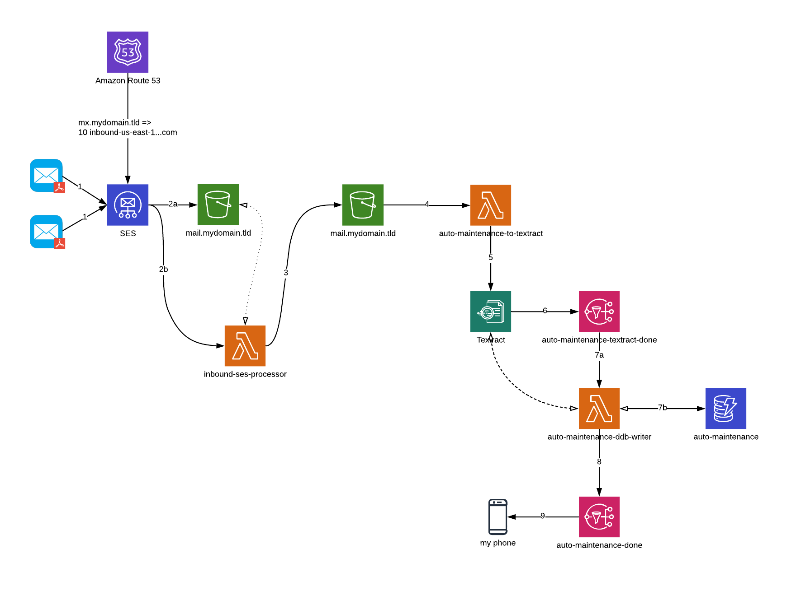

# auto-maintenance

A Serverless Framework application in support of this serverless, email-based document text extraction solution.



A full overview of the solution is available on my [blog](https://bradcod.es/post/building-a-serverless-email-document-extraction-solution-with-aws-textract-part-1-overview/).

## Dependencies

### Local Setup

- Valid, working `npm` in your `PATH`.
- Valid, working `serverless` (or `sls`)in your `PATH`.
- Valid, working `python` in your `PATH` (this should be some rev of Python 3.7).

### AWS

- An [S3 bucket](https://docs.aws.amazon.com/AmazonS3/latest/user-guide/create-bucket.html) to land your email.  At a bare minimum, I would recommend [setting your bucket up with SSE-S3 default encryption](https://docs.aws.amazon.com/AmazonS3/latest/dev/bucket-encryption.html#bucket-encryption-how-to-set-up).

### AWS (or Some Other Registrar)

- Control over your own domain.  You will need to set up an [MX record](https://en.wikipedia.org/wiki/MX_record#targetText=A%20mail%20exchanger%20record%20(MX,for%20load%20balancing%20and%20redundancy.) to point to [SES](https://aws.amazon.com/ses/) for inbound routing and processing.

## Usage

### Setup

Copy `config.yml.example` to `config.yml` and configure according to comments in the file.

### Deploying

```bash
$ npm install
$ export AWS_PROFILE=my-profile
$ export AWS_REGION=us-east-2    # or whatever region suits you
$ serverless deploy
```
